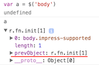

学习了 prevObject 之后发现，我之前写的一篇博客介绍 pushStack 函数那个内容是有问题的。本来我以为这个 pushStack 函数就是一个普通的函数，它接受一个 DOM （数组）参数，把该参数合并到一个 jQuery 对象中并返回该 jQuery 对象。

后来我也疑惑过一段时间，为什么看不到这个函数的使用，而且为什么要把它放到 jQuery.fn 上，直到今天，才恍然大悟。

## jQuery 的 prevObject 对象

当我们新建一个 jQuery 对象的时候，都会在其属性中发现一个 `prevObject` 的属性，如果单单从名字来看的，“前一个对象”，那么它到底是怎么用的呢。



在 jQuery 对象的内部，有着一个 jQuery 对象栈，用来维护所有已经操作过的 jQuery 对象。这样子的话可以写出很流畅的 jQuery 代码，比如操作父元素，操作子元素，再回到父元素的时候就很方便。

但实际上，这个栈是不存在的，我们知道数组可以当作栈或队列来使用，是不是说 jQuery 内部有这么个数组来存放这个对象栈呢。答案是 no，为什么，因为没必要这么麻烦。**这样来想一想，如果每一个 jQuery 对象都有一个指针指向上一个对象的话，也就间接组成了一个 jQuery 对象栈。**如果栈只有一个元素，prevObject 就默认指向 `document`。prevObject 是干什么用的，就是来实现对象栈的。比如：

```html
<div id="view">
  <h1 class="header">标题</h1>
  <p>container</p>
  <strong class="espe">重点</strong>
</div>
```

对于上面的 html：

```javascript
var $view = $("#view");
// $header 是由 $view 操作得到的
var $header = $view.find('.header');
$header.prevObject === $view; // true
```

不过在使用的时候，都是忽略对象栈而定义不同的 jQuery 对象来指向父元素和子元素，就像上面的例子那样，既然定义了 $view 和 $header，就不需要 prevObject 了。

## jQuery.fn.end 和 jQuery.fn.addBack

这两个函数其实就是 prevObject 的应用，举个例子就能弄明白了，仍然是上面的那个 html：

```javascript
$('#view').find('.header').css({'color': 'red'})
  .end()
  .find(.espe).css({'color': 'white'})
```

加了 `end`之后，当前执行的 jQuery 对象就变成 `$('#view')`了，所以可以继续执行 find 操作等等，如果不加的话，这段话是不能执行成功的。可见，如果这样子写 jQuery 不仅写法优雅，而且还很高效。

end 和 addBack 是有区别的，`end()` 函数只是单纯的进行出栈操作，并返回出栈的这个 jQuery 对象，而 `addBack()` 函数不会执行出栈，而是把栈顶对象和当前的对象组成一个新对象，入栈：

```javascript
$('#view').find('.header').nextAll()
  .addBack()
  .css({'color': 'red'}) // 颜色全红
```

上面的代码，会使得 #view 的三个子元素的颜色都设置为红色。

## 相关函数源码

重新来看下 pushStack 函数吧，这个函数不仅在 `fn.find()` 函数中出现，好多涉及 jQuery dom 操作的原型函数都出现了，而且[之前介绍](https://github.com/songjinzhong/JQuerySource/tree/master/03-Sizzle#jqueryfnpushstack)的时候，忽略了一个重要的部分 prevObject 对象：

```javascript
jQuery.fn.pushStack = function (elems) {

  // 将 elems 合并到 jQuery 对象中
  var ret = jQuery.merge(this.constructor(), elems);

  // 实现对象栈
  ret.prevObject = this;

  // 返回
  return ret;
}
```

`pushStack` 生成了一个新 jQuery 对象 `ret`，`ret` 的 prevObject 属性是指向调用 pushStack 函数的那个 jQuery 对象的，这样就形成了一个栈链，其它原型方法如 find、nextAll、filter 等都可以调用 pushStack 函数，返回一个新的 jQuery 对象并维持对象栈。

我们知道了所有 jQuery 方法都有一个 prevObject 属性的情况下，来看看 end 方法：

```javascript
jQuery.fn.end = function () {
  return this.prevObject || this.constructor();
}
```

还有 addBack 方法：

```javascript
jQuery.fn.addBack = function (selector) {
  // 可以看出有参数的 addBack 会对 prevObject 进行过滤
  return this.add(selector == null ? this.prevObject : this.prevObject.filter(selector));
}
```

里面穿插了一个 `fn.add` 方法：

```javascript
jQuery.fn.add = function (selector, context) {
  return this.pushStack(
    jQuery.uniqueSort(
      jQuery.merge(this.get(), jQuery(selector, context))));
}
```

应该不需要解释吧，源码一清二楚。

## 总结

我之前就已经说过，很少会使用 end 或 pushStack 方法，而在 jQuery 内部的原型方法中，比如 find、nextAll、filter 等，被频繁使用，这种封装一个 jQuery 的方法很棒，会把对象栈给维护得很好。无论如何，这就是 jQuery 的魅力吧！

## 参考

>[jQuery 2.0.3 源码分析 回溯魔法 end()和pushStack()](http://www.cnblogs.com/aaronjs/p/3387278.html)

>[jQuery API .end()](http://www.css88.com/jqapi-1.9/end/)

>[jQuery API .addBack()](http://www.css88.com/jqapi-1.9/addBack/)