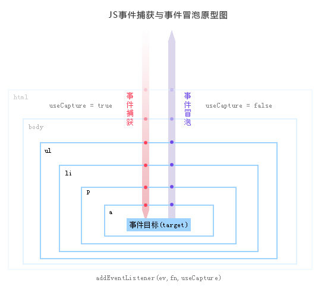

这次的内容是来介绍关于 jQuery 的事件委托。不过在之前呢有必要先来了解一下 JS 中的事件委托与冒泡，我之前也写过类似的博客，[事件冒泡与捕获](http://yuren.space/blog/2016/10/16/%E4%BA%8B%E4%BB%B6%E5%86%92%E6%B3%A1%E4%B8%8E%E6%8D%95%E8%8E%B7/)

## 由 JS 事件引入

事件是 JS DOM 中极具活力的内容，你可以随时监听 DOM 的变化，并对它们及时的做出反应，如果你不是太懂 JS 中的事件，建议你先去看一些相关介绍的文章，直接看 jQuery 中的事件委托头会头大的。

事件的处理顺序由两个环节，一个是捕获环节，一个是冒泡环节，借用别人的一张图：



如果把处理也算进的话，整个事件分为三个阶段，分别是捕获阶段，目标处理阶段和冒泡阶段。捕获阶段由外向内寻找 target，冒泡阶段由内向外直到根结点。这只是一个事件，当这三个阶段中又穿插着更多的事件时，还需要将事件的执行顺序考虑进去。

而 jQuery 事件委托的概念：事件目标自身不处理事件，而是将其委托给父元素或祖先元素或根元素，而借助事件的**冒泡性质**（由内向外）来达到最终处理事件。

## jQuery 中的事件优化

首先必须要知道，绑定事件越多，浏览器内存占用越大，就会间接的影响性能。而且一旦出现 ajax，局部刷新导致重新绑定事件。

使用事件委托可以解决以上带来的问题，借助事件的冒泡，尤其当一个父元素的子元素过多，而且子元素绑定的事件非常多时，委托事件的作用就体现出来了。

我本人不善于比较 JS 中的性能问题，感兴趣的可以去看看这篇文章关于事件委托性能的设计和比较。[深入理解-事件委托](https://gold.xitu.io/entry/5896d04d61ff4b006b0e337a)。

在早期的 jQuery 版本，使用的是 `.delegate()`、`.bind()`、`.live()`等方法来实现事件监听，当然也包括`.click()`方法，随着 jQuery 的发展，像 live 方法已经明确从 jQuery 中删除，而其余的方法，比如 bind 方法也将在 3.0 之后的版本陆续删除，取而代之的是 `.on()`方法。而且剩下的其它方法都是通过 on 方法来间接实现的，如果介绍，只需要看 on 的源码即可。

on 函数在 jQuery 中的用法也很简单，`.on( events [, selector ] [, data ], handler(eventObject) )`events 表示绑定的事件，比如 "click" 或 "click mouseleave"，selector 和 data 是可选的，分别表示要绑定事件的元素和要执行的数据，handler 表示事件执行函数。

off 函数的用法 `.off( events [, selector ] [, handler ] )`，events 代表要移除的事件，selector 表示选择的 dom，handler 表示事件处理函数。还有更残暴的比如 `.off()`不接受任何参数，表示着移除所有 on 绑定的函数。

## on off 函数源码

虽然我分析的源码时 jQuery 3.1.1，但这个时候 bind 和 delegate 函数并没有从源码中移除呢，先来看看它们怎么调用 on：

```javascript
jQuery.fn.extend( {
  bind: function( types, data, fn ) {
    return this.on( types, null, data, fn );
  },
  unbind: function( types, fn ) {
    return this.off( types, null, fn );
  },
  delegate: function( selector, types, data, fn ) {
    return this.on( types, selector, data, fn );
  },
  undelegate: function( selector, types, fn ) {
    // ( namespace ) or ( selector, types [, fn] )
    return arguments.length === 1 ?
      this.off( selector, "**" ) :
      this.off( types, selector || "**", fn );
  }
} );
```

可以看得出来，全都被 on 和 off 这两个函数来处理了。

```javascript
jQuery.fn.extend( {
  on: function (types, selector, data, fn) {
    // on 又依托于全局的 on 函数
    return on(this, types, selector, data, fn);
  }
} );
function on( elem, types, selector, data, fn, one ) {
  var origFn, type;

  // 支持 object 的情况
  if ( typeof types === "object" ) {

    // ( types-Object, selector, data )
    if ( typeof selector !== "string" ) {

      // ( types-Object, data )
      data = data || selector;
      selector = undefined;
    }
    // 一次执行 object 的每一个
    for ( type in types ) {
      on( elem, type, selector, data, types[ type ], one );
    }
    return elem;
  }
  // 参数为两个的情况
  if ( data == null && fn == null ) {

    // ( types, fn )
    fn = selector;
    data = selector = undefined;
  } else if ( fn == null ) {
    if ( typeof selector === "string" ) {

      // ( types, selector, fn )
      fn = data;
      data = undefined;
    } else {

      // ( types, data, fn )
      fn = data;
      data = selector;
      selector = undefined;
    }
  }
  if ( fn === false ) {
    // returnFalse 是一个返回 false 的函数
    fn = returnFalse;
  } else if ( !fn ) {
    return elem;
  }

  if ( one === 1 ) {
    origFn = fn;
    fn = function( event ) {

      // Can use an empty set, since event contains the info
      jQuery().off( event );
      return origFn.apply( this, arguments );
    };

    // Use same guid so caller can remove using origFn
    fn.guid = origFn.guid || ( origFn.guid = jQuery.guid++ );
  }
  return elem.each( function() {
    // 关键
    jQuery.event.add( this, types, fn, data, selector );
  } );
}
```

是的，你没有看错，这个全局的 on 函数，其实只是起到了校正参数的作用，而真正的大头是：

```javascript
jQuery.event = {
  global = {},
  add: function(){...},
  remove: function(){...},
  dispatch: function(){...},
  handlers: function(){...},
  addProp: function(){...},
  fix: function(){...},
  special: function(){...}
}
```

off 函数：

```javascript
jQuery.fn.off = function (types, selector, fn) {
  var handleObj, type;
  if (types && types.preventDefault && types.handleObj) {
    // ( event )  dispatched jQuery.Event
    handleObj = types.handleObj;
    jQuery(types.delegateTarget).off(
      handleObj.namespace ? handleObj.origType + "." + handleObj.namespace : handleObj.origType,
      handleObj.selector,
      handleObj.handler
    );
    return this;
  }
  if (typeof types === "object") {
    // ( types-object [, selector] )
    for (type in types) {
      this.off(type, selector, types[type]);
    }
    return this;
  }
  if (selector === false || typeof selector === "function") {
    // ( types [, fn] )
    fn = selector;
    selector = undefined;
  }
  if (fn === false) {
    fn = returnFalse;
  }
  return this.each(function() {
    // 关键
    jQuery.event.remove(this, types, fn, selector);
  });
}
```

## 总结

可见 jQuery 对于参数的放纵导致其处理起来非常复杂，不过对于使用者来说，却非常大便利。

委托事件也带来了一些不足，比如一些事件无法冒泡，load、submit 等，会加大管理等复杂，不好模拟用户触发事件等。

## 参考

>[jQuery 2.0.3 源码分析 事件绑定 - bind/live/delegate/on](http://www.cnblogs.com/aaronjs/p/3440647.html)

>[深入理解-事件委托](https://gold.xitu.io/entry/5896d04d61ff4b006b0e337a)

>[.on()](http://www.css88.com/jqapi-1.9/on/)